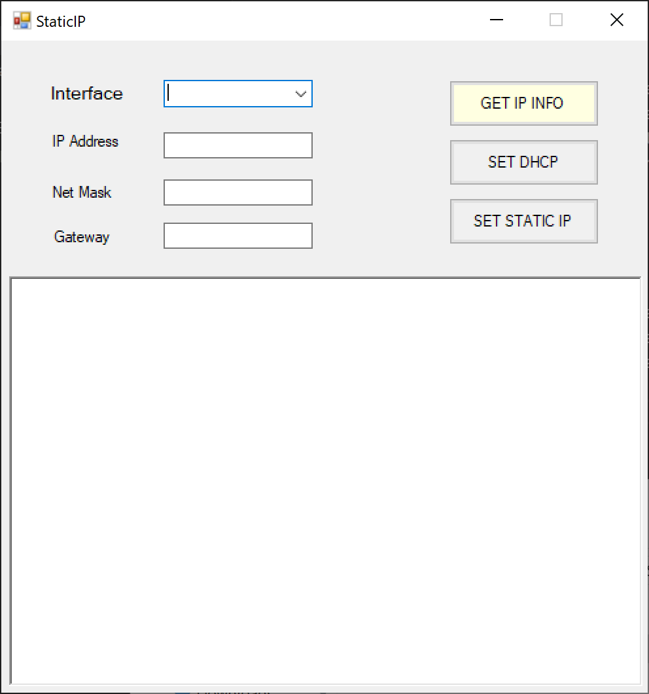
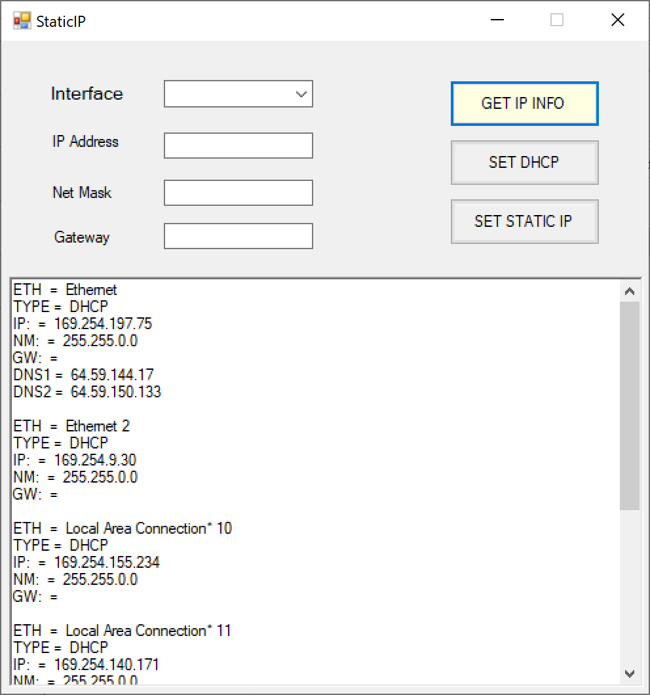
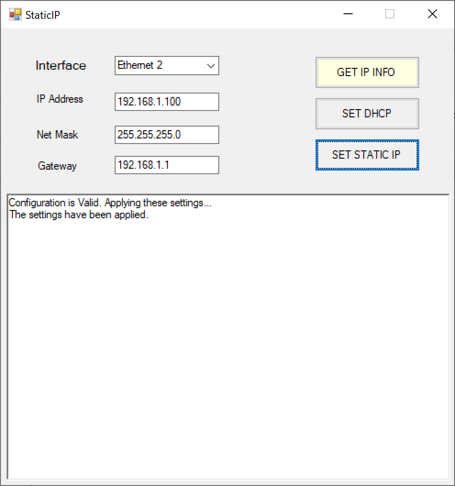
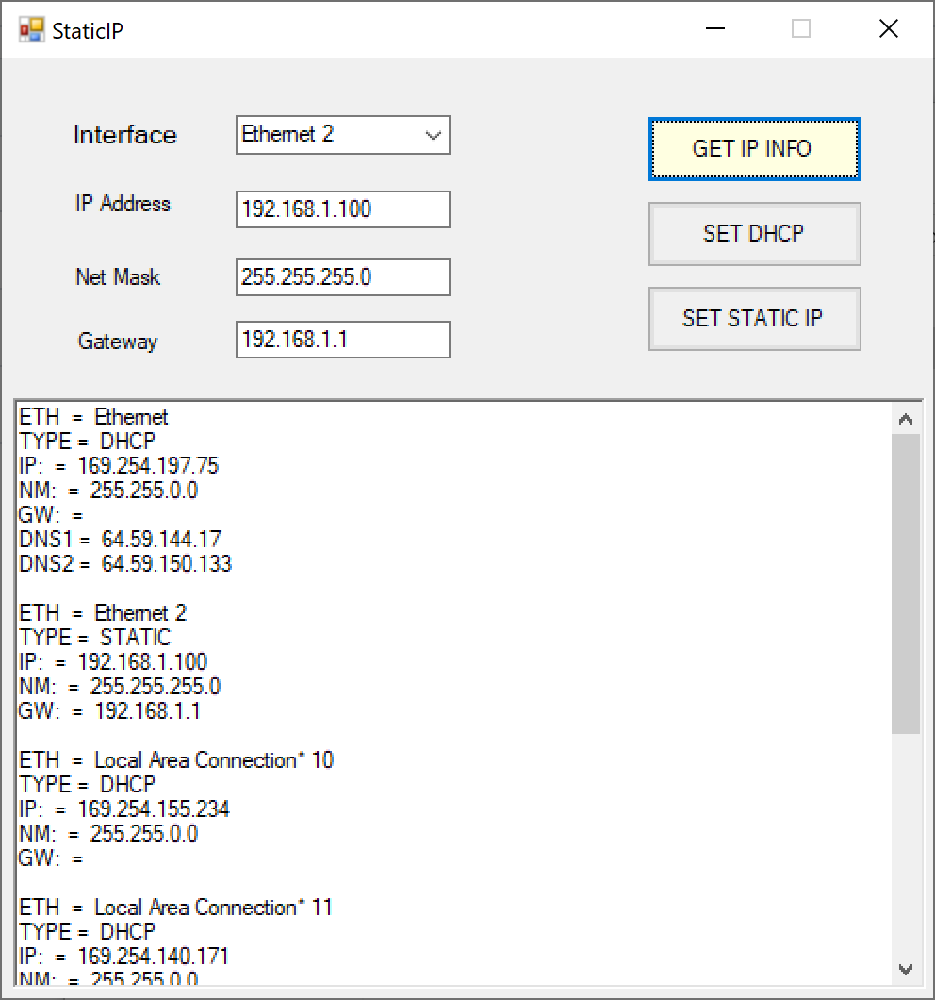
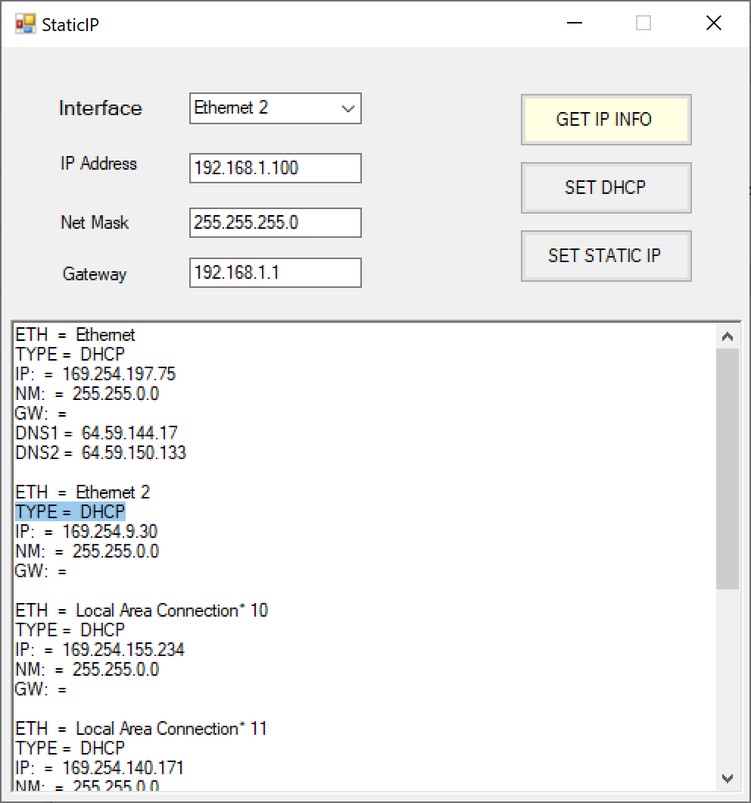

# StaticIP

This project was designed because I was frustrated with changing the IP Address at my work. I have seen a similar tool from which I was inspired to design a batch script. The batch script would change the Ethernet adapter setting based on how I wanted. Now after learning how to make C# programs, I made this program to make it easier for other users.

Please feel free to fork the repository and contribute the project.

# How to Use

* Download files from the download folder
* Right click on 'StaticIP.exe' and Run as Administrator
* Add the configuration to the way you want and set the IP

# Images

